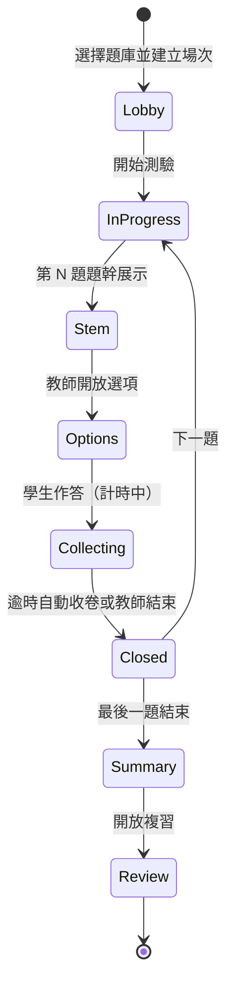
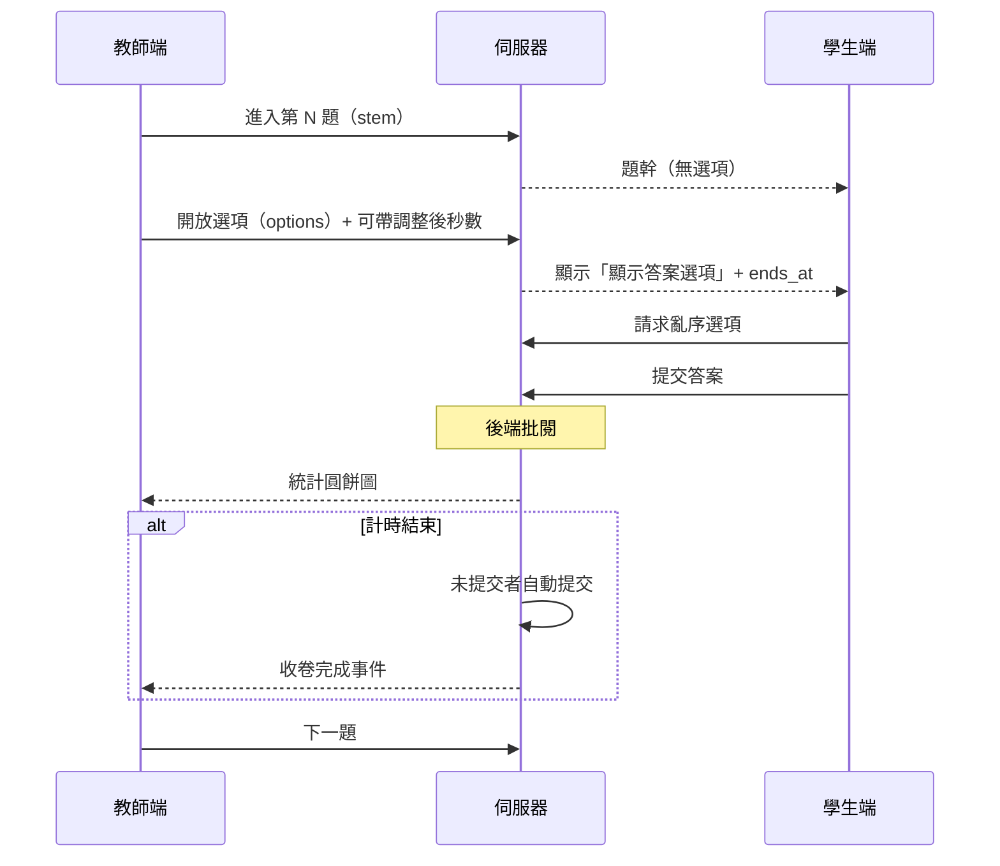
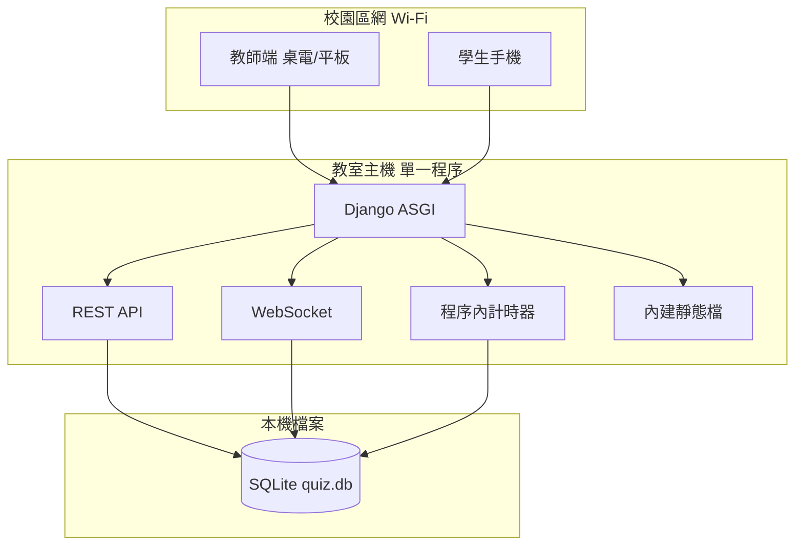

# OnlineQuiz-v2 系統設計書

| 項目 | 內容 |
|------|------|
| 版本 | **v0.6**（校園區網、**Django** 後端） |
| 日期 | 2026-05-29 |
| 狀態 | 已定案，可進入實作 |
| 相關文件 | [題庫 JSON 格式](./QUESTION_BANK_JSON.md)、[實作計畫書](./IMPLEMENTATION_PLAN.md) |

---

## 1. 專案概述

### 1.1 目標

建置一套**教室情境**使用的線上測驗系統：教師在課堂中啟動測驗並主導題目節奏，學生以手機加入、依教師進度逐題作答；系統於後端即時批閱，教師端即時掌握答題分布，測驗結束後提供學生個人複習與解答回饋。

**v1 部署範圍**：以**校園區網（教室 Wi-Fi）**為主，單機運行、架構精簡，**不引入** Redis、獨立資料庫伺服器、CDN、多節點叢集等重型元件。支援教師桌機／平板與學生手持觸控裝置。

### 1.2 設計原則

| 原則 | 說明 |
|------|------|
| 教師主導節奏 | 題目推進、計時、顯示選項時機由教師端控制 |
| 答案不外洩 | 測驗進行中，正確答案僅存於後端；前端不得批閱 |
| 防舞弊 | 每位學生選項順序獨立隨機 |
| 即時回饋 | 單題提交後更新統計；教師端圓餅圖 |
| 雙端體驗 | 教師端：桌電／平板、大螢幕投影；學生端：觸控優先、Mobile First |
| 簡單可維護 | 單程序、單機部署；必要時一鍵啟動腳本即可上課 |
| 區網優先 | 低延遲；QR 指向區網 IP；公網列為日後擴充 |
| 基本安全 | 答案後端批閱、輸入驗證、同場次學號唯一；區網內 HTTP 可接受（HTTPS 可選） |

### 1.3 角色與權限

| 角色 | 說明 | 主要能力 |
|------|------|----------|
| 教師 (Teacher) | 課堂主持人 | 題庫匯入與管理、選擇題庫開場、推題、調整計時、統計與總結 |
| 學生 (Student) | 參與者 | **學號（必填）** + 暱稱加入、作答、測驗後複習 |

> **v1**：教師以 `host_token` 主持場次（無完整帳號系統）。學生以 `學號 + 暱稱 + 場次代碼` 加入；**同一場次學號不可重複**。

### 1.4 非目標（v1 不包含）

- 完整教師／學生帳號與 SSO
- 申論題、填空題
- 多校多租戶營運後台
- Excel 題庫匯入（v1 僅 JSON）

---

## 2. 已確認決策（v0.5）

| # | 項目 | 決策 |
|---|------|------|
| 1 | 多選計分 | **各項獨立計分**，公式見 §9；答錯不倒扣，最低 0 分 |
| 2 | 作答計時 | 每題有**預設秒數**；教師可**當場調整**；逾時**伺服器自動提交**（程序內排程，見 §5.4） |
| 3 | 身份 | **學號必填**；同場次學號唯一 |
| 4 | 題庫 | **JSON 匯入**預先建庫；測驗時**指定題庫**（格式見 [QUESTION_BANK_JSON.md](./QUESTION_BANK_JSON.md)） |
| 5 | 部署 | **校園區網**單機；避免 Redis／獨立 DB 服務／Nginx 等重型軟體（見 §5） |
| 6 | 技術棧 | Vue 3 前端 + **Django 5** + DRF + Channels + **SQLite**；雙端響應式 UI |

### 2.1 後端定案：Django

| 層級 | 方案 |
|------|------|
| REST | **Django REST Framework** |
| 即時 | **Django Channels** + `InMemoryChannelLayer`（單機、無 Redis） |
| ORM | Django ORM + `migrate` |
| 計時 | `threading.Timer`（`quiz/services/timer.py`） |
| 區網服務 | **Daphne**（ASGI） |
| 靜態檔 | **WhiteNoise** 托管 Vue `dist` |
| 選配 | Django Admin 維護題庫（Phase 6+） |

### 2.2 刻意不採用（v1）

| 元件 | 原因 | 替代方案 |
|------|------|----------|
| Redis | 需額外安裝與維運 | Python 程序內 Timer + DB `phase_ends_at` |
| PostgreSQL 獨立服務 | 教室單機過重 | **SQLite** 單檔資料庫 |
| Nginx / 反向代理 | 設定門檻高 | 後端 **同埠**提供 API + 靜態前端 + WebSocket |
| CDN、多實例、K8s | 超出課堂規模 | 單一 Python 程序（建議 &lt;100 人） |
| Docker（正式環境） | 非必要 | `start.bat` / `start.sh` 啟動即可 |
| Celery / RabbitMQ | 過重 | 不使用背景佇列 |

---

## 3. 使用情境與流程

### 3.1 課前準備

1. 教師於「題庫管理」上傳 `questions.json` 格式檔案 → 系統驗證並寫入 DB。  
2. 可設定題庫預設配分、預設作答秒數。

### 3.2 課中流程



### 3.3 單題循環（含計時）



### 3.4 教師端

1. 選擇題庫 → 建立場次 → QR／加入代碼  
2. 大廳：學號 + 暱稱清單  
3. 開始測驗 → 逐題：題幹（無選項）→ 開放選項（可調整倒數）→ 監看提交／圓餅圖 → 下一題  
4. 總結：全班總分分布、各題答對率  
5. 開放複習  

### 3.5 學生端

1. 場次代碼 + **學號** + 暱稱 → 等候  
2. 同步題幹 → 「顯示答案選項」→ 亂序選項 → 作答（顯示剩餘時間）→ 提交或逾時自動送出  
3. 複習：個人作答、得分、正確答案、解析（含 LaTeX 渲染）

---

## 4. 功能需求規格

### 4.1 題庫管理

| ID | 需求 | 優先級 |
|----|------|--------|
| F-01 | JSON 檔匯入題庫（格式見 QUESTION_BANK_JSON.md） | P0 |
| F-02 | 題庫列表、預覽、刪除 | P0 |
| F-03 | 每題：題幹、單選/多選、選項、正確答案、解析、預設配分、預設計時 | P0 |
| F-04 | LaTeX（`$...$`）於前端正確渲染（KaTeX） | P0 |
| F-05 | 建立場次時**選擇題庫**，題目自 DB 載入 | P0 |

### 4.2 場次與同步

| ID | 需求 | 優先級 |
|----|------|--------|
| F-10 | 6 位加入代碼、QR（**區網 URL**，如 `http://192.168.1.50:3080/j/ABC123`） | P0 |
| F-11 | 學生加入：**學號必填**、暱稱；同場次學號唯一 | P0 |
| F-12 | WebSocket 同步階段、題號、計時截止時間 | P0 |
| F-13 | 斷線重連還原狀態 | P1 |

### 4.3 計時與自動收卷

| ID | 需求 | 優先級 |
|----|------|--------|
| F-15 | 每題 `default_timer_seconds`（題庫或題目層級） | P0 |
| F-16 | 進入 `options` 階段時，伺服器記錄 `phase_ends_at` | P0 |
| F-17 | 教師可於作答中調整剩餘秒數（PATCH API + WS 廣播） | P0 |
| F-18 | 逾時：伺服器對**未提交**學生自動提交（空選 → 0 分） | P0 |
| F-19 | 學生端顯示倒數；以伺服器 `phase_ends_at` 為準（防篡改） | P0 |

### 4.4 作答與批閱

| ID | 需求 | 優先級 |
|----|------|--------|
| F-20 | 題幹階段無選項 | P0 |
| F-21 | 選項階段：個人亂序 | P0 |
| F-22 | 批閱僅在後端；進行中不回傳正確答案 | P0 |
| F-23 | 計分規則見 §7.3 | P0 |
| F-24 | 一題一答（含自動提交） | P0 |

### 4.5 統計與複習

| ID | 需求 | 優先級 |
|----|------|--------|
| F-30 | 單題得分分布圓餅圖（即時） | P0 |
| F-31 | 測驗結束：全班總分分布 | P0 |
| F-32 | 各題答對率（**滿分**視為答對） | P0 |
| F-40 | 教師開放後，學生個人複習頁 | P0 |

---

## 5. 系統架構（精簡、區網）

### 5.1 邏輯架構



### 5.2 技術選型（v0.6 定案）

| 層級 | 方案 |
|------|------|
| 前端 | Vue 3 + Vite + Tailwind + Pinia；build 後 WhiteNoise 托管 `frontend/dist` |
| 後端 | **Django 5** + **DRF** + **Channels 4** |
| 驗證 | **Pydantic** v2（JSON 匯入等） |
| DB | **SQLite**（`data/quiz.db`） |
| 計時 | **threading.Timer**（見 §5.4） |
| 區網服務 | **Daphne** |
| 語言 | Python 3.11+ |

### 5.3 校園區網部署拓撲

```
[教師筆電] ──Wi-Fi──┐
[學生手機] ──Wi-Fi──┼──► [教室 AP] ──► [主機 192.168.x.x:3080]
                      │         Python 後端（API + WS + 前端靜態）
                      │         └── data/quiz.db
[投影] ◄── 教師瀏覽器全螢幕題幹
```

**上課前準備（約 5 分鐘）**

1. 主機連上教室 Wi-Fi，設定**固定 IP**（或由路由器 DHCP 保留）。  
2. 執行 `start.bat`（啟動後端 + 已建置之前端）啟動服務。  
3. 教師端開啟 `http://<主機IP>:3080/teacher`，建立場次。  
4. 投影／口頭告知 QR 或 6 位代碼；學生手機連**同一 Wi-Fi** 掃描加入。

**環境變數**

| 變數 | 範例 | 用途 |
|------|------|------|
| `HOST` | `0.0.0.0` | 允許區網其他裝置連線 |
| `PORT` | `3080` | 服務埠（避開 80 需管理員權限） |
| `LAN_BASE_URL` | `http://192.168.1.50:3080` | QR Code、加入連結 |
| `DATABASE_URL` | 見 `settings.py`（預設 `data/quiz.db`） | SQLite 路徑 |

> **日後擴充**：若需公網，可再加 Nginx + HTTPS，無需改動核心業務邏輯。

### 5.4 程序內計時（取代 Redis）

1. 進入 `options` 階段：寫入 `phase_ends_at` 至 SQLite。  
2. 於 **Python 程序內**以 `threading.Timer` 註冊逾時回呼（`TimerService` 集中管理、可 cancel）。  
3. 逾時觸發：查詢未提交學生 → 自動提交 → 批閱 → WebSocket 推送教師端（Flask-SocketIO `emit` 或 Channels `group_send`）。  
4. 教師調整秒數：更新 `phase_ends_at`、**取消並重排**該題 Timer。  
5. 服務重啟恢復：啟動時掃描「已過期且未收卷」場次並補執行收卷。

單機承載建議：**同時 1 個進行中場次、≤100 學生**（`threading` 模式足夠；勿用 eventlet 多 worker 增加複雜度）。

### 5.5 後端目錄結構（Django）

```
backend/
├── config/                  # settings, asgi, urls
├── quiz/
│   ├── models.py
│   ├── api/                 # DRF views
│   ├── services/            # grading, import_json, timer（純 Python）
│   ├── consumers.py         # Channels WebSocket
│   └── routing.py
├── manage.py
└── requirements.txt
frontend/
```

### 5.6 響應式與可操作性（UI/UX）

| 端 | 斷點策略 | 操作要點 |
|----|----------|----------|
| 教師 | `lg+` 雙欄（題目 + 控制/統計）；`md` 單欄可捲動 | 滑鼠/觸控皆可；計時調整用 ± 按鈕與數字輸入 |
| 學生 | Mobile First；最小觸控目標 **44×44px** | 大按鈕、少輸入；學號數字鍵盤；`safe-area-inset` |
| 共通 | 字級 `clamp()`、對比度 WCAG AA | 題幹區可捲動；載入與斷線提示 |

---

## 6. 場次狀態機

### 6.1 場次狀態

`lobby` → `running` → `summary` → `review` → `closed`

### 6.2 單題階段

| 階段 | 說明 | 計時 |
|------|------|------|
| `stem` | 僅題幹 | 不計時 |
| `options` | 可顯示選項並作答 | **計時中**（`phase_ends_at`） |
| `closed` | 本題結束，可看統計 | 停止 |

階段轉換僅教師 API 可觸發（逾時由伺服器自動 `options` → `closed` 並收卷）。

---

## 7. 資料模型

### 7.1 實體關係（摘要）

- `question_banks` 1 ── * `questions` 1 ── * `options`
- `question_banks` 1 ── * `quiz_sessions`
- `quiz_sessions` 1 ── * `participants` 1 ── * `answers`
- `quiz_sessions` 於建立時**快照**題目順序與計時設定（避免匯入後題庫變更影響進行中場次）

### 7.2 主要資料表（增補）

#### `question_banks`
| 欄位 | 說明 |
|------|------|
| id, name, description | 題庫識別 |
| default_points | 預設配分 |
| default_timer_seconds | 預設作答秒數 |
| imported_at | 匯入時間 |

#### `questions`
| 欄位 | 說明 |
|------|------|
| bank_id, order_index | 所屬題庫與順序 |
| stem_text | 題幹原文（含 LaTeX） |
| type | `single` / `multiple` |
| category | 對應 JSON `node` |
| question_type_tag | 對應 JSON `question_type` |
| points, timer_seconds | 可覆寫題庫預設 |
| explanation_text | 解析 |

#### `options`
| 欄位 | 說明 |
|------|------|
| question_id, letter | A/B/C… |
| label_text | 選項內文（去字母前綴後） |
| is_correct | **僅後端** |
| sort_order | 邏輯順序 |

#### `quiz_sessions`
| 欄位 | 說明 |
|------|------|
| bank_id | 選用之題庫 |
| join_code, host_token, status | 場次控制 |
| current_question_index, current_phase | 進度 |
| phase_ends_at | 目前題 options 截止時間（UTC） |
| question_snapshot | jsonb，場次建立時題目 ID 列表 |

#### `participants`
| 欄位 | 說明 |
|------|------|
| student_no | **必填**，同 session 唯一 |
| display_name | 暱稱 |
| client_token | 識別權杖 |

#### `answers`
| 欄位 | 說明 |
|------|------|
| selected_option_ids | 提交選項 |
| score, is_full_score | 批閱結果；`is_full_score` 供答對率 |
| submit_source | `manual` / `auto_timeout` |

---

## 8. API 與即時事件（摘要）

### 8.1 題庫 API

| 方法 | 路徑 | 說明 |
|------|------|------|
| POST | `/api/question-banks/import` | 上傳 JSON 建立題庫 |
| GET | `/api/question-banks` | 題庫列表 |
| GET | `/api/question-banks/:id` | 題庫詳情（不含答案） |
| DELETE | `/api/question-banks/:id` | 刪除題庫 |

### 8.2 場次 API（增補）

| 方法 | 路徑 | 說明 |
|------|------|------|
| POST | `/api/sessions` | body: `{ bankId }` 建立場次 |
| POST | `/api/sessions/:code/join` | body: `{ studentNo, displayName }` |
| PATCH | `/api/sessions/:id/timer` | 教師調整剩餘秒數 |
| POST | `/api/sessions/:id/phase` | 切換階段（可帶 `timerSeconds`） |

### 8.3 WebSocket 事件（增補）

| 事件 | 說明 |
|------|------|
| `session:phase_changed` | 含 `phase`, `questionIndex`, `phaseEndsAt` |
| `session:timer_adjusted` | 教師調整計時 |
| `session:auto_submitted` | 逾時收卷完成（教師端更新人數） |
| `session:question_stats` | 圓餅圖資料 |

---

## 9. 批閱與計分（§7.3 詳規）

### 9.1 符號定義

- \(n\)：該題選項總數  
- \(C\)：正確選項集合（由 `correct_answer` 字母對應）  
- \(S\)：學生提交的選項集合  
- \(k\)：**錯誤項數** = \(|S \triangle C|\)（對稱差異元素個數）  
  - 含「多選錯項」與「漏選應選項」

### 9.2 計分公式

\[
\text{ratio} = \max\left(0,\ \frac{n - 2k}{n}\right),\quad
\text{score} = \text{ratio} \times \text{points}
\]

| 情況 | 結果 |
|------|------|
| \(k = 0\)（\(S = C\)） | 滿分 |
| \(k > 0\) | 依比例給分，**不倒扣** |
| 未作答／逾時空提交 | \(S = \emptyset\)，若應選多項則 \(k = |C|\)，通常為 0 分 |
| 算出分數 &lt; 0 | 以 **0** 計 |

### 9.3 單選題

- `format: Single Choice` → 僅可選一項；\(n\) 仍為選項總數。  
- 選對：\(k=0\)，滿分。選錯一項：\(k=2\)（錯選 1 + 漏選正確 1）→ \(\frac{n-4}{n}\)，\(n=4\) 時為 0 分。

### 9.4 答對率（難易度）

- **答對**定義：`is_full_score = true`（得分 = 該題滿分）。  
- 答對率 = 滿分人數 / 有提交人數（含自動提交）。

### 9.5 範例（\(n=4\)，滿分 2 分）

| 正確 | 學生選擇 | \(k\) | ratio | 得分 |
|------|----------|-------|-------|------|
| ABC | ABC | 0 | 1 | 2 |
| ABC | AB | 1 | 0.5 | 1 |
| ABC | ABCD | 1 | 0.5 | 1 |
| ABC | A | 2 | 0 | 0 |
| B | B | 0 | 1 | 2 |
| B | A | 2 | 0 | 0 |

### 9.6 自動收卷批閱

- `submit_source = auto_timeout`  
- `selected_option_ids = []`（或僅保留學生已勾選但未送出的草稿，若實作本地暫存則一併提交）  
- 依上式計算，通常為 0 分  

---

## 10. 安全與防洩漏（區網情境）

| 項目 | 措施 |
|------|------|
| 傳輸 | 區網內 **HTTP + WS** 即可；敏感環境可選自簽 HTTPS |
| 答案 | `is_correct` 不出現在學生 API；WS 不廣播答案 |
| 計時 | 以伺服器 `phase_ends_at` 為準 |
| 匯入 | JSON 大小限制、Zod 驗證 |
| 濫用 | 基本 rate limit（防誤觸連點）；同場次學號唯一 |
| 網路 | 建議僅綁定教室 VLAN；`host_token` 保護教師操作 |

---

## 11. 非功能需求

| 類別 | 指標 |
|------|------|
| 效能 | 單場 ≤100 人；區網提交至統計 &lt; **300ms** |
| 可用性 | 學生加入 ≤ 4 個欄位；關鍵按鈕觸控區 ≥ 44px |
| 可靠性 | WS 斷線 30s 內重連；計時以伺服器為準 |
| 相容 | iOS Safari / Android Chrome 近兩年；教師端 Chrome / Edge |
| 維護 | 單元測試覆蓋批閱公式；E2E 覆蓋計時收卷 |

---

## 12. 詞彙表

| 詞彙 | 定義 |
|------|------|
| 題庫 | 自 JSON 匯入、存於 DB 的一組題目 |
| 場次 | 一次課堂測驗實例，綁定一個題庫快照 |
| 滿分 / 答對 | 得分等於該題配分（\(k=0\)） |
| 自動提交 | 計時結束由伺服器代為提交 |
