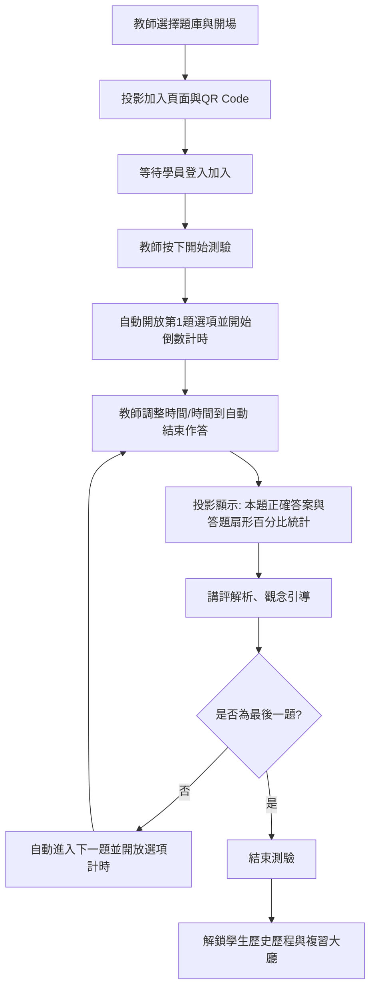

# OnlineQuiz-v2 系統詳細使用及操作手冊

本手冊旨在引導教師、系統管理員與學員，完整理解 [OnlineQuiz-v2](README.md)「教室區網線上互動測驗系統」的功能結構、登入機制、教學現場控場流程，以及新增的學生個人歷史答題歷程與觀念複習系統。

---

## 🧭 一、 系統概述與登入入口

本系統採用 **Django + Flask + Vue 3** 輕量混和架構，不需倚賴複雜的外部資料庫或記憶體快取服務（如 Redis），即可在上課筆電或迷你主機（Windows / macOS / Linux）上，以 SQLite 與快速輪詢機制，支撐百人以上教室的即時互動測驗。

系統劃分三大入口與角色：

### 1. 系統後台與學生匯入 (Django Admin)
* **入口網址：** `http://<您的IP>:8000/admin/`
* **操作人員：** 教師、系統管理員（IT人員）。
* **功能：** 
  * 管理學生的學號、密碼與個人資料
  * 修改系統題庫、檢修個別違規作答
  * 從 CSV 檔批次匯入學生名單

### 2. 教師主控台 (Teacher Dashboard)
* **入口網址：** `http://<您的IP>:5173/login` （選擇 **Teacher** 標籤頁，登入後直達 `http://<您的IP>:5173/teacher`）
* **操作人員：** 課程授課教師、助理（T.A.）。
* **登入憑證：** Django 超級管理員（Superuser）或具管理權限的師長帳密。
* **功能：**
  * 上傳／管理各章節 JSON 題庫（支援 KaTeX 數學公式）
  * 發起互動測驗，投影 QR Code 及測驗加入代碼（Join Code）
  * 全權控場：題幹投影、各題選項解鎖、計時倒數設定、即時答題圖表統計、進入下一題與結束測驗。

### 3. 學生測驗與複習大廳 (Student Dashboard)
* **入口網址：** `http://<您的IP>:5173/login` （選擇 **Student** 標籤頁）
* **操作人員：** 修課學生。
* **登入憑證：** **學號（Student No.）** 與 **密碼（Password）**。（由教師自 [backend/quiz/services/user_import.py](backend/quiz/services/user_import.py) 批次匯入或直接在 Admin 設定）。
* **功能：**
  * **加入測驗（Join Quiz）：** 輸入 Join Code 即刻進入待命大廳並在教師解鎖後進行考題作答。
  * **個人測驗紀錄區（Quiz History）：** 隨時翻閱過往所有作答履歷、得分率、答對狀況與題目觀念詳解（支援 LaTeX 正確渲染）。

---

## 🔒 二、 學生安全登入機制 (學號 + 密碼)

為防範代考、錯用帳號與隱私外洩問題，本系統已淘汰僅利用學號或 Email 無密碼快速登入，全面實施**帳號密碼對**認證：

1. **認證技術規格：**
   * 當學生以學號和密碼送出登入，後端系統（[backend/run_flask.py](backend/run_flask.py)）會自動匹配對應之資料表。
   * 學生密碼利用國際頂級 Django 內置 PBKDF2 演算法加密，以鹽值（Salt）單向雜湊儲存於 `password_hash`，防微杜漸。
   * 登入後，後端隨即派發一組具備時效之 `login_token` (Security Token)，並同步儲存於前端之 `localStorage` 作為 API 接頭的安全憑證。

2. **名單與預設密碼建立：**
   * **情境 A：CSV 批次匯入**
     教師可準備班級 Excel 名單並存為 CSV。結構包含 `student_number`, `name`, `password` 等。若該 CSV 內未定義學生密碼，系統在 [backend/quiz/services/user_import.py](backend/quiz/services/user_import.py) 中，將一律預設為每位學生設定安全登入密碼為 **`test1234`**。
   * **情境 B：手動建置與重設**
     教師亦可直接在 [backend/run_flask.py](backend/run_flask.py) 對應的 Django 管理頁面直接為個別學生重置新密碼。

3. **學生重新登入與中途加入測驗：**
   * 學生可於任何時間重新登入後加入正在進行的測驗場次，**無需教師手動開放搶救**。
   * 重新加入時，**學生仍須輸入該場次的邀請代碼**，以確保加入正確的測驗場次。學號與姓名則由系統自動帶入並鎖定。
   * 重新加入後，系統會自動記錄學生的 **起始題號 (`start_question_index`)**，即學生重新加入當下教師正開放答案選項的題目編號。
   * 學生**只能從當下教師開放答案選項的題目開始作答**，無法取回已經結束開放答案選項的題目重新接收測驗。若學生嘗試取得已結束題目的選項，系統會顯示提示：「此題已於您加入前結束，無法作答。請等待目前開放的題目。」

---

## 📊 三、 教師課堂控場 & 投影片互動測驗

本系統最具特色的是「教師主控、全員互動」的課堂測驗體驗。最佳情境為「教師將主螢幕投影在前台大螢幕」，其餘學生使用手機或筆電作答。



### 【實戰控場三步驟】

#### 步驟 1：題庫與開場
1. 教師於教師主控台選擇「線性代數」或「程式設計」之題庫，按 **開場 (Open Session)**。
2. 投影機畫面上此時會秀出專屬的測驗邀請卡、加入連結與隨機產生的 4 位數加入代碼。
3. 提示學生至 `http://<教師IP>:5173/` 登入學生帳號後，輸入代碼加入等待。學生若已加入，其姓名或代號會即時浮現在教師的待命投影上。確認全員到齊後，點擊 **開始測驗 (Start Quiz)**。

#### 步驟 2：循環答題機制
1. **一鍵開始，自動作答：** 教師按下 **開始測驗 (Begin Quiz)** 後，系統立即開放第一題的答案選項並開始倒數計時，學生即可直接作答。無需再手動按「開放選項」按鈕，大幅減少教師操作負擔。
2. **即時追蹤與截止：** 教師能即時看到大螢幕上顯示「已提交 25/30 人」，可進行口頭催促。時間到後系統自動結束本題，或教師可隨時調整剩餘時間。
3. **解析與百分比統計：** 本題結束後，大螢幕和個人端同時秀出標準解答。大螢幕更會帶出極具震撼的圓餅與直條分析圖（如 A選項 12%, B選項 78%...），教師可據此進行題目精講。
4. **自動下一題：** 講評完畢後，系統自動進入下一題並開放選項與倒數計時，教師無需額外操作。最後一題結束後，測驗自動結束。

#### 步驟 3：釋出複習與觀念定錨
這場測驗對決結束後，教師在結案控制按鈕下，若宣佈「釋出本場次成績至複習庫（釋放存擋）」，學生將能即時在個人帳戶的歷程區完整複讀。

---

## 📈 四、 學生歷史測驗紀錄與觀念複習區

測驗結束後，「了解自己的弱點」是提升學習成效的關鍵。我們在 [frontend/src/views/student/HistoryView.vue](frontend/src/views/student/HistoryView.vue) 中為學生建立了功能強大的專屬學習紀錄庫。

學生隨時能在 `學生端網頁 (Student Layout)` 的導航列點擊 **測驗紀錄 (Quiz History)**，即可查閱：

### 1. 測驗履歷分頁表
* 系統由近到遠條列出學員過去參加的所有班級測驗（如「期中考模擬賽」、「線性代數-向量空間互動」）。
* 表格直觀呈現：**測驗時間**、**總題數**、**個人答對題數**與其**綜合格分百分比**，並採分頁化乾淨排版。

### 2. 精密錯題解析與作答覆盤（點開細節）
點擊表單中的任何一筆測驗紀錄後，底端即會拉出由 [backend/run_flask.py](backend/run_flask.py) 生成之高度結構化試卷比對報告：
* **色彩感知作答：**
  * 若學生作答正確，選中的選項會以綠色底與打勾圖示呈現。
  * 若學生答錯，系統會大紅高亮顯示其錯誤選擇，並用鮮綠色顯耀正確答案，助其直覺反省。
* **高解析度公式排版：**
  題目的向量、矩陣、高斯消去步、或是微積分變數在顯示時，皆經過 `<MathText />` KaTeX 技術正確解析（不只是大題，也包含各選項與說明字段），避免一般線上系統公式變亂碼或僅有圖片。
* **教師觀念白話解析：**
  每道題最底端都有當初題庫中設定好的觀念詳解與白話剖析，便於修課同學在课後自主查漏補缺、重振基礎。

---

## ⚙️ 五、 教師後台管理 & 學生 CSV 批次匯入

為大幅度降低每學期之備課行政負擔，請教師利用 [backend/run_flask.py](backend/run_flask.py) 提供的 Django Admin 功能批次同步班級名單：

1. **進入後台：**
   網址打開 `http://<您的IP>:8000/admin/`，使用超級管理員登密進入。點選 **User Profiles** 的「匯入學生名單」或透過自訂動作。
2. **準備名單 CSV 範本：**
   請使用 Microsoft Excel 或任意文字編輯器，儲存一個標準 `UTF-8`（或傳統帶有 BOM）的 `.csv` 檔案，內容格式如下：
   
   ```csv
   student_number,name,email,password
   110001,王小明,xiaoming@school.edu.tw,mySecurePass99
   110002,陳大同,datong@school.edu.tw,datongPass88
   110003,林曉華,xiaohua@school.edu.tw,
   ```
3. **系統防呆補強機制：**
   * 如上表中的「林曉華」之密碼處直接留白，系統在後端匯入引擎（[backend/quiz/services/user_import.py](backend/quiz/services/user_import.py#L90)）會主動判定：**預設為林曉華設定安全預設登入密碼「test1234」**，這可以大幅簡化教師在課堂上發放密碼的行政流程，學生僅需在初次登入時輸入「學號+學號」即可：
     * **學號：** `110003`
     * **密碼：** `test1234`

---

## 🌐 六、 自主局域網路 (LAN) 與外網 (WAN) 環境快設

班級可能在一般校園 Wi-Fi 教室或有線實驗室，連線步驟如下：

1. **查出本機區網 IP：**
   * 打開 Windows 終端機 (PowerShell)，输入以下命令：
     ```powershell
     ipconfig
     ```
   * 找到您目前上網網卡的 `IPv4 位址`（如 `192.168.1.120` 或國立東華大學常見的 `134.208.XX.XX`）。
2. **更新設定與綁定 (.env配置)：**
   修訂根目錄之 [README.md](README.md) 有關外網設定。在 `frontend` 的 `.env`（或生產建置環境）設定好該對外 IP：
   ```env
   LAN_BASE_URL=http://<本機實際IP>:3080
   ```
3. **防火牆連線防堵放行 (Firewall Unblock)：**
   學生的行動裝置如果要連進教室主筆電，預設可能會遭到 Windows 防火牆阻擋。
   * 請以系統管理員權限執行本專案特備之防火牆開放工具 [scripts/open-firewall.bat](scripts/open-firewall.bat)。它會自動添加 Windows Advanced Firewall TCP port 放行規則對外宣洩 `5173`, `5174`, `8000`, `3080` 流量。
4. **網際網路 (WAN) / 校外同學混和連線：**
   本機實體 IP 不是公網固定 IP。若要滿足不在同一個地點的學生（如因病在家修課、校外實習同仁、或行動通訊連線）：
   * **方法 A (Tailscale 虛擬局域網路)：**
     引導師生安裝免費 Tailscale 並加入同個群組，教师即可將連線 IP 設定為 Tailscale 分配之 `100.XX.XX.XX` IP，即能跨縣市跨網路暢玩！
   * **方法 B (ngrok 反向代理透傳)：**
     直接開一個 command 對接，指令：`ngrok http 5173`。即可獲得一組 `https://xxxx.ngrok-free.app` 的網址，直接給校外同學用手機登錄！

---

## ❓ 七、 常見問題排除 (FAQ)

### Q1：學生登入時一直顯示「連線失敗或帳密錯誤」？
* **A：**
  1. 請教師至 Admin 後台（[backend/run_flask.py](backend/run_flask.py) 管理處）確認該生的 `UserProfile` 中學號（Student No.）是否存在。
  2. 若帳號存在但學生忘記密碼，請管理員在 Admin 直接修改該生 Profile 並重新輸入其重設密碼。
  3. 確認伺服器的 Flask 在 Port 8000 (或 5000) 於主機上依然在健康執行（可打開網址 `http://localhost:5000/api/health/` 確定是否有心跳 API 傳回）。

### Q2：考題中好不容易配上的「數學公式」呈現一堆代碼 $...$ 卻沒有變成精美公式？
* **A：** 
  * 本專案完美融合了 KaTeX 加速排版。公式必須被包含在標準單個錢字號 `$...$`（行內公式，如 $\sigma(x)=\frac{1}{1+e^{-x}}$）或雙個錢字號 `$$...$$`（區塊換行公式，如二維矩陣）中。
  * 如果學生看到的是原始碼，請確認：
    1. 題庫中該欄位沒有錯置字元。
    2. [frontend/src/views/student/HistoryView.vue](frontend/src/views/student/HistoryView.vue) 正確導引為 `<MathText :text="question.text" />`，它會把 markdown 中的公式分開，送入 KaTeX 處理器。

### Q3：如何定期備份學生這些極具教學學術研討價值的「答題大數據」？
* **A：**
  * 本系統極其輕巧，將所有的班級設定、學生帳密、答題得分、以及互動題庫在運行時皆存在 SQLite 單一檔案中。
  * 備份路徑：位於 [backend/](backend/) 的 [backend/config/settings.py](backend/config/settings.py#L90) 資料庫設定中指定儲存的資料夾。當您关闭伺服器後，僅需複製資料庫檔案 (預設在 `backend/` 下或根目錄 `data/quiz.db`)，即可輕鬆隨處移植備份！

---

💡 *本系統專為現代互動式高效能教室而生，願本指南帶給師生最佳的課堂體驗！*
